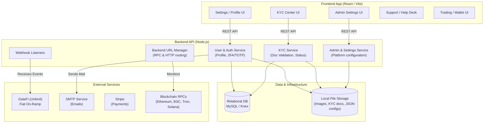

# Primerica Exchange - System Architecture

This document provides a high-level component overview of the Primerica Exchange platform for quick AI context boarding.

```mermaid
graph TD
    %% Frontend Application Layer
    subgraph Frontend ["Frontend App (React / Vite)"]
        UI_Settings["Settings / Profile UI"]
        UI_KYC["KYC Center UI"]
        UI_Admin["Admin Settings UI"]
        UI_Support["Support / Help Desk"]
        UI_Trading["Trading / Wallet UI"]
    end

    %% Backend Services Layer
    subgraph Backend ["Backend API (Node.js)"]
        API_User["User & Auth Service\n(Profile, 2FA/TOTP)"]
        API_KYC["KYC Service\n(Doc Validation, Status)"]
        API_Admin["Admin & Settings Service\n(Platform configuration)"]
        API_UrlMgr["Backend URL Manager\n(RPC & HTTP routing)"]
        API_Webhooks["Webhook Listeners"]
    end

    %% Database & Local Storage Layer
    subgraph Infrastructure ["Data & Infrastructure"]
        DB[(Relational DB\nMySQL / Knex)]
        Storage[("Local File Storage\n(Images, KYC docs, JSON configs)")]
    end

    %% External Integrations Layer
    subgraph External ["External Services"]
        EXT_GateFi["GateFi (Unlimit)\nFiat On-Ramp"]
        EXT_SMTP["SMTP Service\n(Emails)"]
        EXT_Stripe["Stripe\n(Payments)"]
        EXT_Blockchain["Blockchain RPCs\n(Ethereum, BSC, Tron, Solana)"]
    end

    %% Relationships - Frontend to Backend
    UI_Settings -->|REST API| API_User
    UI_KYC -->|REST API| API_KYC
    UI_Admin -->|REST API| API_Admin
    
    %% Relationships - Backend to Infrastructure
    API_User --> DB
    API_User --> Storage
    API_KYC --> DB
    API_KYC --> Storage
    API_Admin --> Storage
    
    %% Relationships - Backend to External
    API_Webhooks -->|Receives Events| EXT_GateFi
    API_User -->|Sends Mail| EXT_SMTP
    API_UrlMgr -->|Monitors| EXT_Blockchain
```